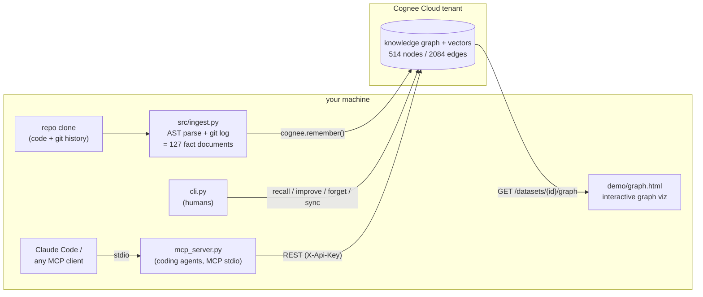

# graphtour

> *Never ask "who knows this code?" again.* graphtour turns any repo into a queryable graph memory , powered by [Cognee](https://www.cognee.ai).

Ask your codebase **"what breaks if I change this?"** graphtour ingests a repo's
code, commits, and PRs into a Cognee knowledge graph and answers by *traversing*
dependencies, ownership, and history instead of grepping.

Built for the **WeMakeDevs × Cognee** hackathon 

---

## The problem

A new contributor drops into an unfamiliar repo and asks the questions grep can't answer:
- *"What breaks if I change this function?"* (impact)
- *"Who should I ask about this module?"* (ownership)
- *"Why does this even exist , which PR introduced it?"* (provenance)

These are **relationship** questions. Keyword search and plain RAG can't follow the
edges between files, commits, authors, and PRs. A graph can.

## The solution

graphtour models a codebase as what it actually is , a graph and uses Cognee's
memory lifecycle to keep that graph honest as the repo evolves:

| Cognee verb | graphtour uses it to |
|-------------|----------------------|
| `remember`  | ingest files, commits, PRs, authors and their edges into the graph |
| `recall`    | traverse the graph to answer impact / ownership / provenance questions |
| `improve`   | re-weight and enrich the graph as the repo changes and on feedback |
| `forget`    | prune deleted files and dead paths so the memory stays truthful |

**Demo:** graphtour onboards you to *Cognee's own* repository.

## Architecture



How the pieces earn their place:

- **Fact documents, not raw code.** `src/ingest.py` AST-parses every file and
  reads `git log`, then writes compact English sentences ("Commit abc123 was
  authored by NAME... it modified files F1, F2"). Cognee's cognify pass turns
  those into exactly the edges the queries need (imports, authored, modified),
  cleaner and roughly 10x cheaper than feeding source code to an LLM.
- **Lenses over recall.** Impact, ownership, and provenance are the same
  `cognee.recall()` call with mode-specific prompt templates (`src/recall.py`)
  that steer traversal toward the right edge types, plus a strict system
  prompt that forbids inventing files, people, or commits.
- **The MCP server speaks REST, not the SDK.** `cognee.serve()` hangs inside
  MCP stdio subprocesses on Windows (stdout is the JSON-RPC wire, and the SDK
  blocks). So `mcp_server.py` talks to the tenant's REST API through
  `src/cloud_rest.py`: instant startup, nothing can pollute the protocol
  stream, same graph.
- **Versioned datasets** (`src/state.py`). Cognee Cloud leaves a forgotten
  dataset name unusable, so `sync` writes `graphtour_repo_v2`, `_v3`, ...,
  switches an active-dataset pointer, and only then forgets the old version.
  A failed sync can never leave the memory empty.

## Backends

One code path, two backends , selected by `COGNEE_BACKEND` in `.env`:
- **cloud**  [Cognee Cloud](https://platform.cognee.ai)
- **local**  self-hosted, open-source Cognee

## Quickstart

```bash
python -m venv .venv && . .venv/Scripts/activate   # Windows
pip install -r requirements.txt
cp .env.example .env        # then fill in your Cognee Cloud URL + API key
python cli.py smoke         # verify the connection
```

## Status

- [x] Batch 0  scaffold, config switch, connection smoke test
- [x] Batch 1  ingest a repo into the graph
- [x] Batch 2  impact / ownership / provenance queries
- [x] Batch 3  MCP server for coding agents + `improve()` / `forget()` / `sync`
- [ ] Batch 4  UX + demo
- [ ] Batch 5  README polish, demo video, submission

## Use it from Claude Code (MCP)

graphtour is also an MCP server, so coding agents get persistent codebase memory:

```bash
claude mcp add graphtour -- python mcp_server.py
```

Tools exposed: `ask_impact`, `ask_ownership`, `ask_provenance`, `ask_codebase`,
and `remember_insight` (agents store durable insights that outlive their context window).

---

*Built with the assistance of Claude Code (Anthropic).*
